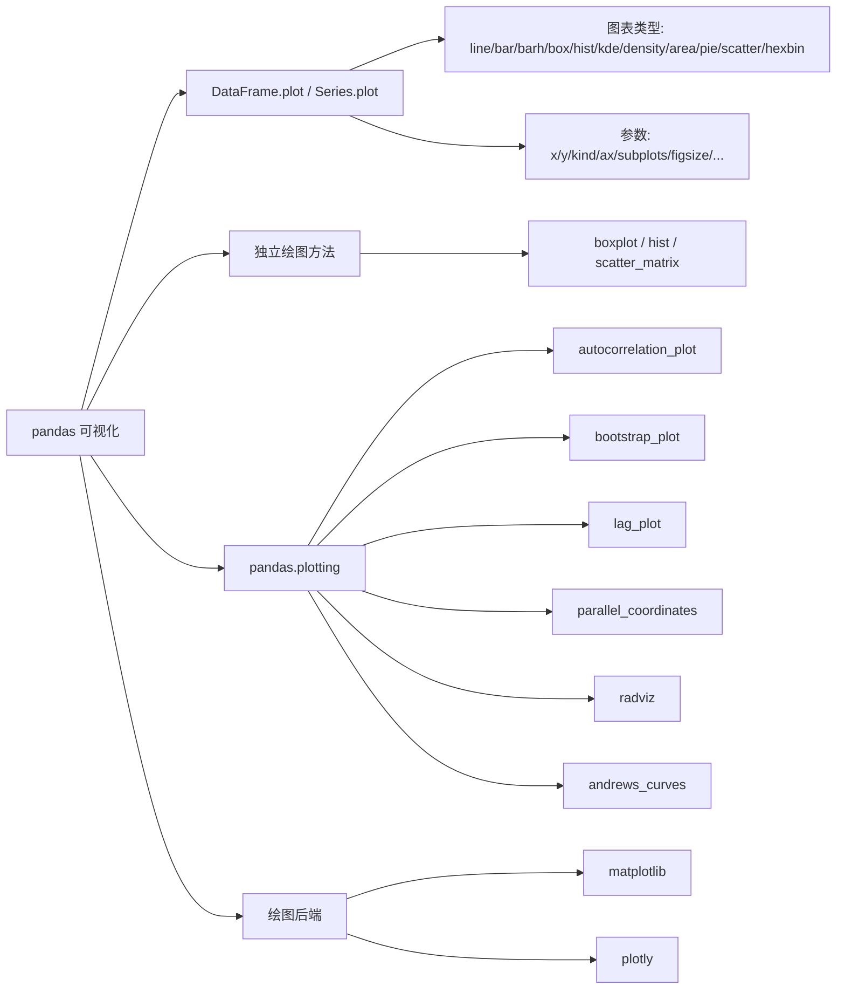

> [!abstract] 章节概览
> pandas 基于 matplotlib 构建了简洁的**高级绘图接口**，仅需一行代码即可生成常见统计图表。本章涵盖 `DataFrame.plot` / `Series.plot` 绘图接口、独立绘图方法、`pandas.plotting` 专用统计图形模块，以及可插拔的绘图后端机制。

## 📑 章节地图

| 子章节 | 核心内容 | 笔记 |
| ------ | -------- | ---- |
| 1. DataFrame.plot / Series.plot | 11 种图表类型 + 27 个绘图参数 | [[十九、可视化/1. DataFrame.plot 与 Series.plot\|1. DataFrame.plot / Series.plot]] |
| 2. 独立绘图方法 | `boxplot()`、`hist()`、`scatter_matrix()` | [[十九、可视化/2. 独立绘图方法\|2. 独立绘图方法]] |
| 3. pandas.plotting | 六种专用统计图形 | [[十九、可视化/3. pandas.plotting\|3. pandas.plotting]] |
| 4. 绘图后端 | matplotlib、plotly 等 | [[十九、可视化/4. 绘图后端\|4. 绘图后端]] |

## 🧭 知识脉络

## 💡 核心要点

- **最常用接口**：`df.plot(kind='line')` 与 `df.plot.line()` 完全等价，均基于 matplotlib 封装。
- **散点图与六边形分箱图**必须显式指定 `x`、`y` 参数，其他图表类型可省略。
- **饼图**通常配合 `subplots=True` 或指定 `y` 参数使用。
- 绘图方法返回 `Axes` 对象（单图）或 `ndarray`（多子图），可继续用 matplotlib API 微调。
- **`df.boxplot()` 与 `df.plot.box()` 行为不同**：前者每列一个独立子图，后者合并到同一坐标轴。
- 通过 `pd.options.plotting.backend` 可无缝切换后端（matplotlib → plotly）。

## 🔗 相关笔记

- [[知识大纲]]
- 上游章节：[[十八、统计与数学计算]]
- 下游章节：[[content/python/pandas/20 配置、选项与全局设置/index]]
