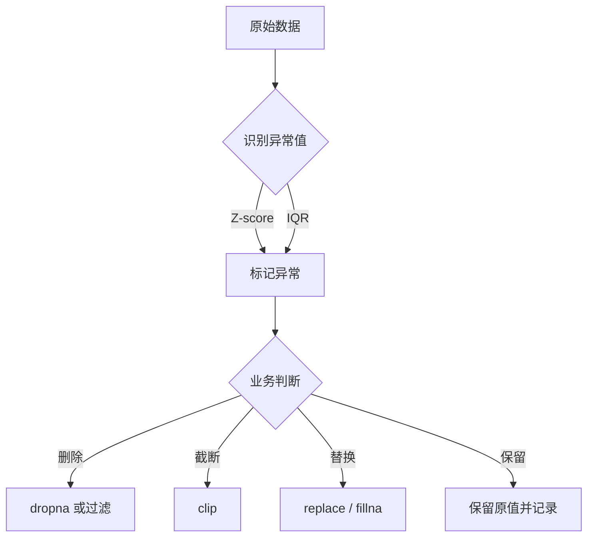

> 异常值（Outlier）是偏离大部分数据分布的值，可能由测量误差、录入错误或真实罕见情况产生。异常值处理通常包括：**识别**与**修正/截断/替换**。

---

## 1. 基于标准差的异常值识别（Z-score 方法）

适合近似正态分布的数据。通常认为与均值相差超过 **3 个标准差**（或 2.5 个）的值属于异常值。

### 原理

$$Z = \frac{x - \mu}{\sigma}$$

- 若 $|Z| > 3$，则认为该点为异常值
- 也可以用 $|x - \mu| > 3\sigma$ 等价判断

### 示例

```python
import pandas as pd
import numpy as np

data = pd.DataFrame({'值': [10, 12, 11, 100, 13, 12, 11, 10, 200]})

# 计算 Z-score
data['Z'] = (data['值'] - data['值'].mean()) / data['值'].std()

# 标记异常值
data['异常'] = data['Z'].abs() > 3
print(data)

# 筛选异常值
data[data['异常']]
```

```python
# 更简洁的写法
mean = data['值'].mean()
std = data['值'].std()
data['异常'] = (data['值'] - mean).abs() > 3 * std
```

> [!warning] 注意
> - 使用 `std()` 时，pandas 默认使用总体标准差（`ddof=0`），Numpy 默认 `ddof=0` 与之不同。若需样本标准差可指定 `ddof=1`。
> - 观察值较少时（如 n<10），3 个标准差可能过于宽松，需结合业务调整。

---

## 2. 基于 IQR 的异常值识别

IQR（四分位距）方法不依赖分布假设，适用于偏态分布。IQR 定义为第三四分位数（Q3）与第一四分位数（Q1）之差。

$$IQR = Q3 - Q1$$

通常认为小于 $Q1 - 1.5 \times IQR$ 或大于 $Q3 + 1.5 \times IQR$ 的值为异常值（可调整系数为 1.5 或 3）。

### 示例

```python
data = pd.DataFrame({'值': [10, 12, 11, 100, 13, 12, 11, 10, 200]})

Q1 = data['值'].quantile(0.25)
Q3 = data['值'].quantile(0.75)
IQR = Q3 - Q1

lower_bound = Q1 - 1.5 * IQR
upper_bound = Q3 + 1.5 * IQR

data['异常'] = (data['值'] < lower_bound) | (data['值'] > upper_bound)
print(data)
```

```python
# 查看上下界
print(f"异常值下界: {lower_bound:.2f}")
print(f"异常值上界: {upper_bound:.2f}")

# 筛选非异常值
clean_data = data[~data['异常']]
```

> [!tip] 调整系数
> - 使用 `1.5 * IQR` 识别“疑似异常值”
> - 使用 `3 * IQR` 识别“极端异常值”

---

## 3. 使用 clip() 截断异常值

`clip()` 可以将超出上下限的值压缩到边界，常用于限幅处理。它本身并不删除数据，而是将异常值替换为边界值。

### 参数详解

| 参数 | 说明 |
|------|------|
| `lower` | 下界（小于它的值被替换为该值），可为标量、数组或 Series |
| `upper` | 上界（大于它的值被替换为该值） |
| `axis` | 对齐轴 |
| `inplace` | 是否原地修改 |

### 示例

```python
s = pd.Series([1, 100, 2, 3, 200, 4])

# 截断到 [0, 50] 之间
s.clip(lower=0, upper=50)
# 0      1
# 1     50
# 2      2
# 3      3
# 4     50
# 5      4

# 只设置上界
s.clip(upper=100)

# 只设置下界
s.clip(lower=10)

# DataFrame 按列截断
df = pd.DataFrame({'A': [1, 100], 'B': [200, 2]})
df.clip(lower=0, upper=100)
#      A    B
# 0    1  100
# 1  100    2

# 使用 Series 作为上下界（按列对齐）
lower = pd.Series({'A': 0, 'B': 10})
upper = pd.Series({'A': 50, 'B': 100})
df.clip(lower=lower, upper=upper, axis=1)
```

### 基于 IQR/标准差配合 clip

```python
# 用 IQR 边界截断
data['值_截断'] = data['值'].clip(lower_bound, upper_bound)
```

> [!warning] 注意
> `clip()` 直接修改值，不标记异常。若需要保留异常标记，先计算布尔列再 clip。

---

## 4. 使用 replace() 替换异常值

`replace()` 可以将特定异常值替换为 `NaN`、边界值、或统一的值。

### 示例

```python
s = pd.Series([10, 12, 11, 100, 13, 12, 11, 10, 200])

# 将特定值替换为 NaN
s.replace(100, np.nan)
s.replace([100, 200], np.nan)

# 将大于 50 的全部替换为 NaN（需配合 where/mask）
s.where(s <= 50, np.nan)

# 使用 mask 将大于 50 的替换为上界
s.mask(s > 50, 50)
```

### 结合异常值识别

```python
# 识别后替换
mask = (data['值'] < lower_bound) | (data['值'] > upper_bound)
data.loc[mask, '值'] = np.nan
data['值'].fillna(data['值'].median())    # 用中位数填充
```

---

## 5. 其他异常值处理方式

### 删除异常值（慎用）

```python
clean_data = data[~data['异常']].copy()
```

### 盖帽法（Winsorize）

将异常值替换为分位数对应的值（如 1% 和 99% 分位数）。

```python
p1 = data['值'].quantile(0.01)
p99 = data['值'].quantile(0.99)
data['值_修正'] = data['值'].clip(p1, p99)
```

### 分组处理

```python
# 按组识别异常值
def mark_outlier(group):
    Q1 = group.quantile(0.25)
    Q3 = group.quantile(0.75)
    IQR = Q3 - Q1
    return (group < Q1 - 1.5 * IQR) | (group > Q3 + 1.5 * IQR)

data['异常'] = data.groupby('组别')['值'].transform(mark_outlier)
```

---

## 6. 处理流程建议



| 场景 | 推荐方法 |
|------|---------|
| 录入错误（如年龄 999） | `replace` 或指定条件填充 |
| 长尾分布（如收入） | `clip` 到分位数边界 |
| 时间序列（传感器） | `interpolate()` 替换为插值 |
| 分析前预处理 | Z-score 或 IQR 标记后决定保留/删除 |
| 机器学习建模 | 通常保留或盖帽，避免信息丢失 |

> [!warning] 关键提醒
> 异常值**并不总是错误**，可能包含真实业务信息。处理前务必结合业务场景和数据含义进行判断，并保留处理记录。

---
