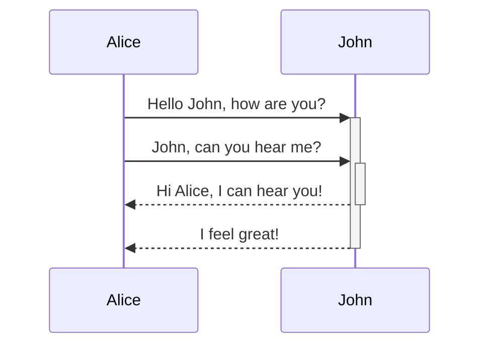

# frontmatter

Quartz supports the following frontmatter:

- title
- description
- permalink
- comments
- lang
- publish
- draft
- enableToc
- tags
- aliases
- cssclasses
- socialDescription
- socialImage
- created
- modified
- published

- `title`: Title of the page. If it isn’t provided, Quartz will use the name of the file as the title.
- `description`: Description of the page used for link previews.
- `permalink`: A custom URL for the page that will remain constant even if the path to the file changes.
- `aliases`: Other names for this note. This is a list of strings.
- `tags`: Tags for this note.
- `draft`: Whether to publish the page or not. This is one way to make [pages private](https://quartz.jzhao.xyz/features/private-pages) in Quartz.
- `date`: A string representing the day the note was published. Normally uses `YYYY-MM-DD` format.

# obsidian支持markdown用法

|语法|描述|
|---|---|
|`[[Link]]`|[内部链接](https://obsidian.md/zh/help/links)|
|`![[Link]]`|[插入文件](https://obsidian.md/zh/help/embeds)|
|`![[Link#^id]]`|[块引用](https://obsidian.md/zh/help/links#%E9%93%BE%E6%8E%A5%E5%88%B0%E7%AC%94%E8%AE%B0%E4%B8%AD%E7%9A%84%E5%9D%97)|
|`^id`|[定义块](https://obsidian.md/zh/help/links#%E9%93%BE%E6%8E%A5%E5%88%B0%E7%AC%94%E8%AE%B0%E4%B8%AD%E7%9A%84%E5%9D%97)|
|`[^id]`|[脚注](https://obsidian.md/zh/help/syntax#%E8%84%9A%E6%B3%A8)|
|`%%Text%%`|[注释](https://obsidian.md/zh/help/syntax#%E6%B3%A8%E9%87%8A)|
|`~~Text~~`|[删除线](https://obsidian.md/zh/help/syntax#%E7%B2%97%E4%BD%93%E3%80%81%E6%96%9C%E4%BD%93%E3%80%81%E9%AB%98%E4%BA%AE)|
|`==Text==`|[高亮](https://obsidian.md/zh/help/syntax#%E7%B2%97%E4%BD%93%E3%80%81%E6%96%9C%E4%BD%93%E3%80%81%E9%AB%98%E4%BA%AE)|
|` ``` `|[代码块](https://obsidian.md/zh/help/syntax#%E4%BB%A3%E7%A0%81%E5%9D%97)|
|`- [ ]`|[未完成任务](https://obsidian.md/zh/help/syntax#%E4%BB%BB%E5%8A%A1%E5%88%97%E8%A1%A8)|
|`- [x]`|[已完成任务](https://obsidian.md/zh/help/syntax#%E4%BB%BB%E5%8A%A1%E5%88%97%E8%A1%A8)|
|`> [!note]`|[标注](https://obsidian.md/zh/help/callouts)|
|（见链接）|[表格](https://obsidian.md/zh/help/advanced-syntax#%E8%A1%A8%E6%A0%BC)|

# mermaid

````md

````


# callouts

````md
> [!info]+ 这是标注的标题
> 这是一个标注块。
> 它支持 **Markdown**、[[内部链接|内部链接]] 和 [[插入文件|嵌入]]！
> ![[Engelbart.jpg]]
````

> [!info]+ 这是标注的标题
> 这是一个标注块。
> 它支持 **Markdown**、[[内部链接|内部链接]] 和 [[插入文件|嵌入]]！
> 